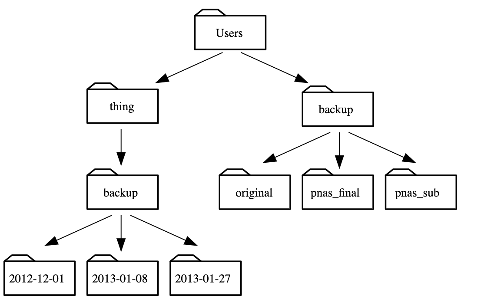

# Lecture Homework: Practice exercises due 4-15-19 before class.

### Hoffman2

1. What is the procedure for logging into Hoffman2?
  a. Open terminal and a shell will apear. Type in ssh c177-"your given number"@hoffman2.idre.ucla.edu
  b. Once done you will enter the password you created
2. What is the first thing that you do once you login?  What is the command?
  a. When you log in you should type pwd to see what pathway you are in.

___

### Using 'ls'

1. You can use two flags at the same time. What does the command ls do when used with the -l flag? What about if you use both the -l and the -h flag?
  a. ls -l will list a long format of the directory contents
  b. la -l -h will list a long format of the directory contents in print sizes that are human readable such as 1K, 234M and 2G

2. The command ls -R lists the contents of directories recursively, i.e., lists their sub-directories, sub-sub-directories, and so on at each level. The command ls -t lists things by time of last change, with most recently changed files or directories first. In what order does ls -R -t display things? Hint: ls -l uses a long listing format to view timestamps.
  a. ls -R -t will display things recursively witht eh newest first

---

### Shortcuts

1. what is ~
  a. With cd this will take you home
2. what is ../
  a. With cd this will take you to a directory or users
3. what is ./?
  a. will take you to a relative pathway with cd

4. Starting from /Users/amanda/data, which of the following commands could Amanda use to navigate to her home directory, which is /Users/amanda?  Indicate what each command does.
````
$ cd . NO
$ cd / NO
$ cd /home/amanda NO
$ cd ../.. NO
$ cd ~ YES
$ cd home NO
$ cd ~/data/.. NO
$ cd YES
$ cd .. YES
````
---
### File systems

1. Using the filesystem diagram below, if pwd displays `/Users/thing`, what will `ls -F ../backup` display?

  a. `../backup: No such file or directory`NO
 
  b. `2012-12-01 2013-01-08 2013-01-27` NO

  c. `2012-12-01/ 2013-01-08/ 2013-01-27/` YES

  d. `original/ pnas_final/ pnas_sub/` NO


2. Using the filesystem diagram below, if pwd displays `/Users/backup`, and -r tells ls to display things in reverse order, what command(s) will result in the following output:

```
pnas_sub/ pnas_final/ original/
```

  a. `ls pwd` NO

  b. `ls -r -F` YES

  c. `ls -r -F /Users/backup` NO

  <p align="center">

</p>

---

### Making files and appending stuff

1. do: 
```
$ touch my_file.txt
```
 What did the touch command do? When you look at your current directory using the GUI file explorer, does the file show up?
  a. The touch file changed the file time stamp
  b. The file does not show up on the shell

 Use 'ls -l' to inspect the files. How large is my_file.txt?
  a. The my_file.txt is empty
 When might you want to create a file this way?
  a. You might want to create an empty file or to change a timestamp on an existing file

 Can you use touch to edit my_file.txt?
  a. No you can not, you would have to use vi

2. We have seen the use of >, but there is a similar operator >> which works slightly differently. We’ll learn about the differences between these two operators by printing some strings. We can use the echo command to print strings e.g.

```
$ echo The echo command prints text
```
The echo command prints text
Now test the commands below to reveal the difference between the two operators:
```
$ echo hello > testfile01.txt
```
and:
```
$ echo hello >> testfile02.txt
```
What is the difference between > and >> ?
Hint: Try executing each command twice in a row and then examining the output files.
  a. > is sued to overwrite a file and >> is used to append to a file.

3. We have already met the head command, which prints lines from the start of a file. tail is similar, but prints lines from the end of a file instead.

Consider the file `/u/home/class/c177/c177-i0/classdata/Homework_data/data-shell/data/animals.txt`. After these commands, select the answer that corresponds to the file animals-subset.txt:

```
$ head -n 3 animals.txt > animals-subset.txt
```

```
$ tail -n 2 animals.txt >> animals-subset.txt

1. The first three lines of animals.txt
2. The last two lines of animals.txt
3. The first three lines and the last two lines of animals.txt
4. The second and third lines of animals.txt

  a. Option 3 is correct. For option 1 to be correct you would have to run only the head command. For option 2 to be correct you would have to run only the tail command. Fo option 4 to be correct you would have to pipe the poutput of head into tail -n 2 at the end (head -n 3 animals.txt | tail -n 2 > animals-subset.txt)

---
### Copying, Moving and deleting files

1. After running the following commands, Jamie realizes that she put the files sucrose.dat and maltose.dat into the wrong folder:
```
$ ls -F
 analyzed/ raw/
$ ls -F analyzed
fructose.dat glucose.dat maltose.dat sucrose.dat
$ cd raw/
```
Fill in the blanks to move these files to the current folder (i.e., the one she is currently in):

```
$ mv ___/sucrose.dat  ___/maltose.dat ___
  a. mv raw/sucrose.dat raw/maltose.dat
```

2. Suppose that you created a plain-text file in your current directory to contain a list of the statistical tests you will need to do to analyze your data, and named it: statstics.txt

After creating and saving this file you realize you misspelled the filename! You want to correct the mistake, which of the following commands could you use to do so?

  a. `cp statstics.txt statistics.txt` YES

  b. `mv statstics.txt statistics.txt` YES

  c. `mv statstics.txt .` NO

  d. `cp statstics.txt .`NO

3. What is the output of the closing ls command in the sequence shown below?
```
$ pwd
/Users/jamie/data
$ ls
proteins.dat
$ mkdir recombine
$ mv proteins.dat recombine/
$ cp recombine/proteins.dat ../proteins-saved.dat
$ ls
```

a. `proteins-saved.dat recombine` NO
b. `recombine` NO
c. `proteins.dat recombine` NO
d. `proteins-saved.dat`YES


4. What happens when we execute `rm -i thesis_backup/quotations.txt`? Why would we want this protection when using rm?
  a. We would want this protection becasue rm -i will prompt us before removing a file, especiallly an important one we may not want to delete.

5. In the example below, what does cp do when given several filenames and a directory name?
  a. cp will copy all the listed files and place them in backup
```
$ mkdir backup
$ cp amino-acids.txt animals.txt backup/
```

6. In the example below, what does cp do when given three or more file names?
  a. With three or more file names, cp will copy amino-acids.txt into animals.txt then animal.txt into morse.txt 
```
$ ls -F
amino-acids.txt  animals.txt  backup/  elements/  morse.txt  pdb/  planets.txt  salmon.txt  sunspot.txt
```

```
$ cp amino-acids.txt animals.txt morse.txt
```

7. Sam has a directory containing calibration data, datasets, and descriptions of the datasets:
```
.
├── 2015-10-23-calibration.txt
├── 2015-10-23-dataset1.txt
├── 2015-10-23-dataset2.txt
├── 2015-10-23-dataset_overview.txt
├── 2015-10-26-calibration.txt
├── 2015-10-26-dataset1.txt
├── 2015-10-26-dataset2.txt
├── 2015-10-26-dataset_overview.txt
├── 2015-11-23-calibration.txt
├── 2015-11-23-dataset1.txt
├── 2015-11-23-dataset2.txt
├── 2015-11-23-dataset_overview.txt
├── backup
│   ├── calibration
│   └── datasets
└── send_to_bob
    ├── all_datasets_created_on_a_23rd
    └── all_november_files
```

Before heading off to another field trip, she wants to back up her data and send some datasets to her colleague Bob. Sam uses the following commands to get the job done:
```
$ cp *dataset* backup/datasets
$ cp ___calibration___ backup/calibration                cp *calibration* backup/datasets
$ cp 2015-___-____ send_to_bob/all_november_files/       cp 2015-11-23 send_to_bob/all_november_files/
$ cp ____ send_to_bob/all_datasets_created_on_a_23rd/    cp all_novemeber_files send_to_bob/all_datasets_created_on_a_23rd/
```
Help Sam by filling in the blanks.

The resulting directory structure should look like this
```
.
├── 2015-10-23-calibration.txt
├── 2015-10-23-dataset1.txt
├── 2015-10-23-dataset2.txt
├── 2015-10-23-dataset_overview.txt
├── 2015-10-26-calibration.txt
├── 2015-10-26-dataset1.txt
├── 2015-10-26-dataset2.txt
├── 2015-10-26-dataset_overview.txt
├── 2015-11-23-calibration.txt
├── 2015-11-23-dataset1.txt
├── 2015-11-23-dataset2.txt
├── 2015-11-23-dataset_overview.txt
├── backup
│   ├── calibration
│   │   ├── 2015-10-23-calibration.txt
│   │   ├── 2015-10-26-calibration.txt
│   │   └── 2015-11-23-calibration.txt
│   └── datasets
│       ├── 2015-10-23-dataset1.txt
│       ├── 2015-10-23-dataset2.txt
│       ├── 2015-10-23-dataset_overview.txt
│       ├── 2015-10-26-dataset1.txt
│       ├── 2015-10-26-dataset2.txt
│       ├── 2015-10-26-dataset_overview.txt
│       ├── 2015-11-23-dataset1.txt
│       ├── 2015-11-23-dataset2.txt
│       └── 2015-11-23-dataset_overview.txt
└── send_to_bob
    ├── all_datasets_created_on_a_23rd
    │   ├── 2015-10-23-dataset1.txt
    │   ├── 2015-10-23-dataset2.txt
    │   ├── 2015-10-23-dataset_overview.txt
    │   ├── 2015-11-23-dataset1.txt
    │   ├── 2015-11-23-dataset2.txt
    │   └── 2015-11-23-dataset_overview.txt
    └── all_november_files
        ├── 2015-11-23-calibration.txt
        ├── 2015-11-23-dataset1.txt
        ├── 2015-11-23-dataset2.txt
        └── 2015-11-23-dataset_overview.txt
```

7. Jamie is working on a project and she sees that her files aren’t very well organized:
```
$ ls -F
analyzed/  fructose.dat    raw/   sucrose.dat
```
The fructose.dat and sucrose.dat files contain output from her data analysis. What command(s) covered in this lesson does she need to run so that the commands below will produce the output shown?
  a. cd analyzed
  b. mv fructose.dat sucrose.dat /analyzed
```
$ ls -F
analyzed/   raw/
$ ls analyzed
fructose.dat    sucrose.dat
```

8. You’re starting a new experiment, and would like to duplicate the directory structure from your previous experiment so you can add new data.

Assume that the previous experiment is in a folder called ‘2016-05-18’, which contains a data folder that in turn contains folders named raw and processed that contain data files. The goal is to copy the folder structure of the 2016-05-18-data folder into a folder called 2016-05-20 so that your final directory structure looks like this:

```
2016-05-20/
└── data
    ├── processed
    └── raw
```

Which of the following set of commands would achieve this objective? What would the other commands do?
```
$ mkdir 2016-05-20       
$ mkdir 2016-05-20/data               THESE 4 SETS OF COMMANDS WOULD NOT ACHIEVE THIS OBJECTIVE
$ mkdir 2016-05-20/data/processed                                          
$ mkdir 2016-05-20/data/raw  


$ mkdir 2016-05-20
$ cd 2016-05-20
$ mkdir data                        THIS SET OF 5 COMMANDS WOULD ACHIEVE THIS GOAL
$ cd data
$ mkdir raw processed


$ mkdir 2016-05-20/data/raw
$ mkdir 2016-05-20/data/processed
$ mkdir 2016-05-20
$ cd 2016-05-20                     
$ mkdir data
$ mkdir raw processed

  THESE SET OF COMMANDS COMINDED WILL PLACE DATA, RAW AND PROCESSED INTO THE FILE 2016-05-20 TOGETHER                                       INSTEAD OF HAVING DATA AS A SUB DIRECTORY IN 2016-05-20
```
---

### Sort, Piping, Uniq, Cut

1. If we run sort on a file containing the following lines:

10
2
19
22
6
the output is:

10
19
2
22
6
If we run sort -n on the same input, we get this instead:

2
6
10
19
22

Explain why -n has this effect.
  a. sort -n has this affect because -n sorts a numerical rather than an alphabetical sort.
  
2. In our current directory, we want to find the 3 files which have the least number of lines. Which command listed below would work?
```
wc -l * > sort -n > head -n 3 
wc -l * | sort -n | head -n 1-3 
wc -l * | head -n 3 | sort -n   
wc -l * | sort -n | head -n 3  

  a. Option 4 is the solution. | is for the output form one process to the standard input of another. > is used to redirect standard output to a file

3. The command uniq removes adjacent duplicated lines from its input. For example, the file 'data-shell/data/salmon.txt' contains:
```
coho
coho
steelhead
coho
steelhead
steelhead
```
Running the command uniq salmon.txt from the 'data-shell/data' directory produces:
```
coho
steelhead
coho
steelhead
```
Why do you think uniq only removes adjacent duplicated lines? (Hint: think about very large data sets.) What other command could you combine with it in a pipe to remove all duplicated lines?
  a. The command uniq is helpful especially with large data sets because the adjacent duplicates take up undeeded space, but it will not delete all of the duplicates in the file unless they are adjecent to each other. 
  b. You could use sort salmon.txt | iniq 


4. A file called animals.txt (in the data-shell/data folder) contains the following data:
```
2012-11-05,deer
2012-11-05,rabbit
2012-11-05,raccoon
2012-11-06,rabbit
2012-11-06,deer
2012-11-06,fox
2012-11-07,rabbit
2012-11-07,bear
```

What text passes through each of the pipes and the final redirect in the pipeline below?
```
$ cat animals.txt | head -n 5 | tail -n 3 | sort -r > final.txt

  a.The head command will take the first 5 lines from animals.txt
  b.Then by using tail, the last 3 lines are taken from the previous 5
  c.sort -r will then sort those 3 lines in reverse order
  d.that output is then redirected to the file final.txt
  
  
```
Hint: build the pipeline up one command at a time to test your understanding


5. For the file animals.txt from the previous exercise, the command:
```
$ cut -d , -f 2 animals.txt
```
uses the -d flag to split each line by comma, and the -f flag to print the second field in each line, to give the following output:
```
deer
rabbit
raccoon
rabbit
deer
fox
rabbit
bear
```

What other command(s) could be added to this in a pipeline to find out what animals the file contains (without any duplicates in their names)?

  a. cut -d , -f 2 animals.txt | sort | uniq


6. The file animals.txt contains 8 lines of data formatted as follows:
```
2012-11-05,deer
2012-11-05,rabbit
2012-11-05,raccoon
2012-11-06,rabbit
...
```
Assuming your current directory is data-shell/data/, what command would you use to produce a table that shows the total count of each type of animal in the file? 

 

```
grep {deer, rabbit, raccoon, deer, fox, bear} animals.txt | wc -l
sort animals.txt | uniq -c
sort -t, -k2,2 animals.txt | uniq -c
cut -d, -f 2 animals.txt | uniq -c
cut -d, -f 2 animals.txt | sort | uniq -c   ***THIS ONE WILL WORK***
cut -d, -f 2 animals.txt | sort | uniq -c | wc -l
  
  a. This one will work cut -d, -f 2 animals.txt | sort | uniq -c 
---

### Wildcards

1. Wildcard expressions can be very complex, but you can sometimes write them in ways that only use simple syntax, at the expense of being a bit more verbose. Consider the directory `data-shell/north-pacific-gyre/2012-07-03`: the wildcard expression ` \*[AB].txt`  matches all files ending in A.txt or B.txt. Imagine you forgot about this.

Can you match the same set of files with basic wildcard expressions that do not use the [ ] syntax? Hint: You may need more than one expression.

  a. ls *A.txt and ls *B.txt
  b. The output from the nre commands is seperated because there are two commands
  c. When there are no files ending in A.txt or B.txt then an error message will appear
  

The expression that you found and the expression from the lesson match the same set of files in this example. What is the small difference between the outputs?

Under what circumstances would your new expression produce an error message where the original one would not?

2. Suppose you want to delete your processed data files, and only keep your raw files and processing script to save storage. The raw files end in .dat and the processed files end in .txt. Which of the following would remove all the processed data files, and only the processed data files?
```
rm ?.txt
rm \*.txt
rm \* .txt
rm \*.\*

  a.rm ?.txt will remove .txt files with one character names
  b.rm \*.txt is the correct answer
  c.rm \* .txt would make shell match everything in the current directory to * so it would try to remove all matched files and an             additional file called .txt
  d.rm \*.\* would match all the files with an extension, so this would delete all files
```

___

## More practice in shell  

For this part of the homework you will practice unix commands. 
While doing the exercises you will be generating files with the name "For_Daniel...txt". 
When you are done will all exercises, including the las part called "Practice on real data", you 
have to push the files with the name "For_Daniel...txt"  
to the repository that contain this assignment. The one you created when you 
navigated this link:  
You should push to the respository .. files:  
* For_Daniel_Wildcard.txt
* For_Daniel_grep.txt
* For_Daniel_find.txt
* For_Daniel_realData.txt 


On hoffman navigate to your HOME directory.
Then, clone the repository of the 
book [Introduction to Scientific Computing for Biologists](https://allesinalab.uchicago.edu/wp-content/uploads/2014/05/IntroSciComp2014.pdf).
Here is the link for the
repostiroy: https://github.com/pceeb/UCLA_Spring_2019.git  
Then do the following exercises. 
Daniel will navigate to your folder you to verify that you have done everything.  

### Unix shorcuts  
```
Ctrl + A Go to the beginning of the line
Ctrl + E Gototheendoftheline
Ctrl + L Clears the screen
Ctrl + U Clears the line before the cursor position
Ctrl + K Clear the line after the cursor
Ctrl + C Kill whatever you are running
Ctrl + D Exit the current shell
```

**DO THIS**  
```
$ cd IntroSciComp2014
$ cd UNIX
$ cd Sandbox
$ pwd
$ ls
$ touch TestFile
$ mv TestFile TestFile2
$ rm TestFile2
$ mkdir TestDirectory
$ touch TestDirectory/Test.txt
$ rmdir TestDirectory
$ rm TestDirectory/Test.txt
$ rmdir TestDirectory
```
### Redirection and pipes  

**TRY THESE**  
```
$ echo "My first line." > test.txt
$ cat test.txt
$ echo "My second line" >> test.txt
$ ls / >> ListRootDir.txt
$ cat ListRootDir.txt
```
### Wildcards  

**DO THIS**  
```
$ mkdir TestWild
$ cd TestWild
$ touch File1txt
$ touch File2.txt
$ touch File3.txt
$ touch File4.txt
$ touch File1.csv
$ touch File2.csv
$ touch File3.csv
$ touch File4.csv
$ touch Anotherfile.csv
$ touch Anotherfile.txt
$ ls
$ ls | wc -l
```

Proof-of-Work
```
$ history | tail -n 30 > For_Daniel_Wildcard.txt
```

**DO THIS**  
```
$ ls *
$ ls File*
$ ls *.txt
$ ls File?.txt
$ ls File[1-2].txt
$ ls File[!3].*
```
## Grep  

wget retrieves data from the web. Do this:    
```
wget http://www.cep.unep.org/pubs/legislation/spawannxs.txt
head -n 50 spawannxs.txt
$ grep Orchidaceae spawannxs.txt
$ grep -c Orchidaceae spawannxs.txt
```

Find Falco  
```
$ grep Falco spawannxs.txt
```

-i makes case insensitive    
```
$ grep -i Falco spawannxs.txt
```

grepping for ara (macaws) creates undesired results  
```
grep -i ara spawannxs.txt
```

use -w to search for whole words  
```
grep -i -w ara spawannxs.txt
```

-A x and -B x will show lines before or after the match  
```
grep -i -w -A 1 ara spawannxs.txt
```

-n will show the line numbers of a match  
```
Use -n to show the line number of the match:
```

-v will show the lines that do NOT match patters  
```
grep -i -w -v ara spawannxs.txt
```

Proof-of-Work
```
$ history | tail -n 30 > For_Daniel_grep.txt
```

### finding files with find  
**DO THIS**  
```
$ mkdir TestFind
$ cd TestFind
$ mkdir -p Dir1/Dir11/Dir111
$ mkdir Dir2
$ mkdir Dir3
$ touch Dir1/File1.txt
$ touch Dir1/File1.csv
$ touch Dir1/File1.tex
$ touch Dir2/File2.txt
$ touch Dir2/File2.csv
$ touch Dir2/File2.tex
$ touch Dir1/Dir11/Dir111/File111.txt
$ touch Dir3/File3.txt
```

Using find:  
* find . -name yourfile to find by name  
* find . -iname yourfile to ignore case!  
* find . -name -maxdepth number yourfile to ignore subdirectories beyond a specified depth !  
* find . not -name yourfile get files and directories that do not match name  

**TRY THIS**  
```
$ find . -name "File1.txt"  
$ find . -name "*.txt"  
$ find . -maxdepth 2 -name "*.txt"  
$ find . -maxdepth 2 -not -name "*.txt"  
$ find . -type d  
$ find . -type f -exec ls -s {} \; | sort -n | head -10  
```
Proof-of-Work
```
$ history | tail -n 30 > For_Daniel_find.txt
```
---

## Practice on real data  
From the book [Introduction to Scientific Computing for Biologists](https://allesinalab.uchicago.edu/wp-content/uploads/2014/05/IntroSciComp2014.pdf). 
Do exercise **2.13.2**; **2.13.3**; and **2.13.4** (bonus points for the last part of 2.13.4!).  
To get the data you need for these exercises you need to clone the repository of the book. Here is the link https://bitbucket.org/AllesinaLab/introscicomp2014.git  

Proof-of-Work
```
$ history | tail -n 50 > For_Daniel_realData.txt
```

## Most exercises (all but the Hoffman2 bit) were generated by Software Carpentry: http://swcarpentry.github.io/shell-novice/aio.html. The last section of exercises 
were taken from [Introduction to Scientific Computing for Biologists](https://allesinalab.uchicago.edu/wp-content/uploads/2014/05/IntroSciComp2014.pdf)

https://creativecommons.org/licenses/by/4.0/

