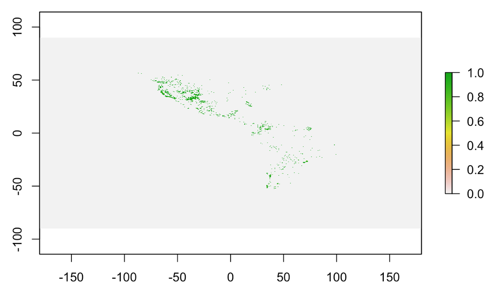
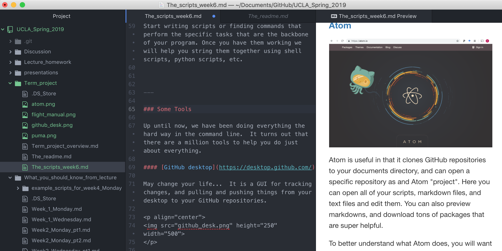
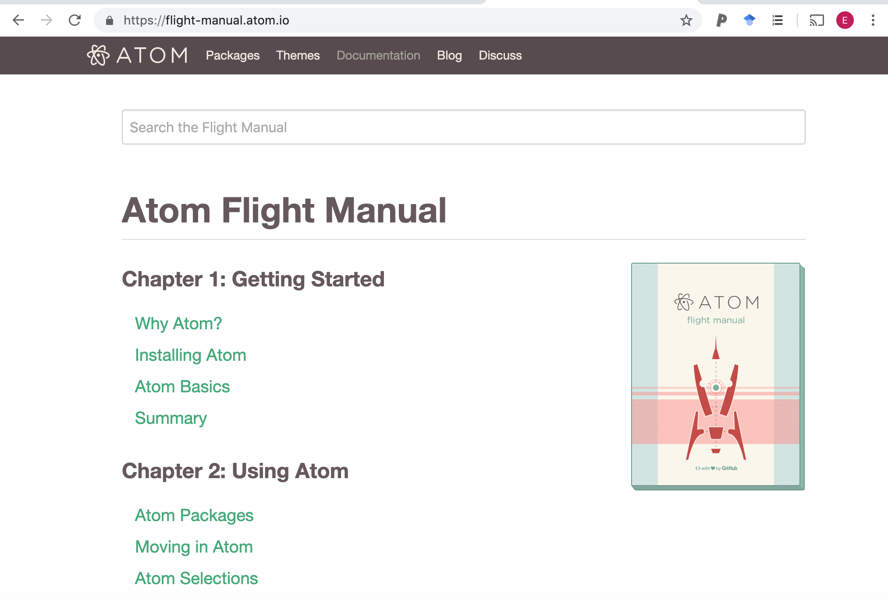

# Discussion Week 5: Starting to write scripts

Hopefully by now you will have figured out why you are doing your project and the general strategy for your program.  Now you need to considers the scripts that you need to make your program work.

---

#### If you are building a shiny app...
you first need to find the scripts that underly the app.  For example, if you are going to model Lotka-Volterra mutualism dynamics, you need to find the R scripts for that model.  Daniel has a cookbook for community ecology simulations, you should not need to build any of these from scratch (Emily, give this book to Daniel).  Once you have those working, you will be able to figure out how to make the scripts interactive with in the shiny app.

Here are some great resources for building a shiny app:

https://shiny.rstudio.com/tutorial/

https://deanattali.com/blog/building-shiny-apps-tutorial/

https://medium.freecodecamp.org/build-your-first-web-app-dashboard-using-shiny-and-r-ec433c9f3f6c

---

### If you are using R to say something interesting about species found in eDNA data...

you have different challenges.  First you need to learn how to extract the species information from a large data file that looks something like this:

```
PITS_seq_number	PITS_aDNA.neg.S49.L001	PITS_pos.mix.S51.L001	PITS_PrePCR.neg.S50.L001	PITS_T1.A1.T2.S1.L001	PITS_T1.A2.T2.S2.L001	PITS_T1.B1.T2.S3.L001	PITS_T1.B2.T2.S4.L001	PITS_T1.C1.T2.S5.L001	PITS_T1.C2.T2.S6.L001	PITS_T2.A1.T2.S7.L001	PITS_T2.A2.T2.S8.L001	PITS_T2.B1.T2.S9.L001	PITS_T2.B2.T2.S10.L001	PITS_T2.C1.T2.S11.L001	PITS_T2.C2.T2.S12.L001	PITS_T3.A1.T2.S13.L001	PITS_T3.A2.T2.S14.L001	PITS_T3.B1.T2.S15.L001	PITS_T3.B2.T2.S16.L001	PITS_T3.C1.T2.S17.L001	PITS_T3.C2.T2.S18.L001	PITS_T4.A1.T2.S19.L001	PITS_T4.A2.T2.S20.L001	PITS_T4.B1.T2.S21.L001	PITS_T4.B2.T2.S22.L001	PITS_T4.C1.T2.S23.L001	PITS_T4.C2.T2.S24.L001	PITS_T5.A1.T2.S25.L001	PITS_T5.A2.T2.S26.L001	PITS_T5.B1.T2.S27.L001	PITS_T5.B2.T2.S28.L001	PITS_T5.C1.T2.S29.L001	PITS_T5.C2.T2.S30.L001	PITS_T6.A1.T2.S31.L001	PITS_T6.A2.T2.S32.L001	PITS_T6.B1.T2.S33.L001	PITS_T6.B2.T2.S34.L001	PITS_T6.C1.T2.S35.L001	PITS_T6.C2.T2.S36.L001	PITS_T7.A1.T2.S37.L001	PITS_T7.A2.T2.S38.L001	PITS_T7.B1.T2.S39.L001	PITS_T7.B2.T2.S40.L001	PITS_T7.C1.T2.S41.L001	PITS_T7.C2.T2.S42.L001	PITS_T8.A1.T2.S43.L001	PITS_T8.A2.T2.S44.L001	PITS_T8.B1.T2.S45.L001	PITS_T8.B2.T2.S46.L001	PITS_T8.C1.T2.S47.L001	PITS_T8.C2.T2.S48.L001	sum taxonomy
forward_PITS_1	0	0	0	0	0	0	0	2	0	0	4	0	3	0	0	4	0	0	0	0	2	2	0	8	4	0	3	2	2	0	0	3	4	2	3	1	4	0	0	0	0	0	0	0	3	3	2	0	0	0	0	Eukaryota;Streptophyta;Bryopsida;Bryales;Bryaceae;Gemmabryum;Gemmabryum dichotomum
forward_PITS_2	0	0	0	0	0	0	0	0	1	0	0	0	1	0	0	0	2	0	1	1	4	1	2	8	2	0	3	0	3	0	2	6	4	0	1	1	0	0	0	0	0	4	0	2	0	0	0	0	1	5	3	Eukaryota;Streptophyta;Bryopsida;Bryales;Bryaceae;;
forward_PITS_3	0	0	0	0	1	0	0	0	0	0	3	0	2	0	1	1	0	0	0	2	2	0	0	2	0	2	0	0	4	1	1	5	1	1	0	2	1	1	0	0	0	2	0	0	3	0	3	0	2	2	1	Eukaryota;Streptophyta;Bryopsida;Bryales;Bryaceae;Gemmabryum;Gemmabryum dichotomum
forward_PITS_4	0	0	0	0	0	0	0	1	4	0	4	0	2	0	0	0	0	8	0	1	1	0	2	0	1	0	6	2	1	0	0	0	0	0	1	0	0	0	1	0	0	0	1	1	0	1	1	0	0	0	5	Eukaryota;Chlorophyta;Chlorophyceae;Chlamydomonadales;NA;Tetracystis;Tetracystis pampae
forward_PITS_5	0	0	0	1	1	0	0	1	0	0	1	0	0	3	1	0	0	1	0	3	1	2	0	0	3	0	1	1	0	3	1	1	1	1	0	0	1	0	0	0	0	0	0	0	3	0	6	1	1	0	1	Eukaryota;Streptophyta;Klebsormidiophyceae;Klebsormidiales;Klebsormidiaceae;Klebsormidium;
forward_PITS_6	0	0	0	0	1	0	0	0	0	0	1	0	1	1	1	1	1	0	1	0	1	2	0	4	0	0	2	0	1	0	1	3	3	1	0	0	0	0	0	0	0	1	0	0	2	1	1	0	0	1	0	Eukaryota;Streptophyta;Bryopsida;Bryales;Bryaceae;Gemmabryum;Gemmabryum dichotomum
forward_PITS_7	0	0	0	1	0	6	2	0	0	2	1	0	1	0	0	0	0	0	0	1	0	1	0	1	0	2	0	1	2	0	0	1	0	0	0	0	2	0	0	0	0	0	0	0	0	4	0	0	1	1	0	Eukaryota;Chlorophyta;Trebouxiophyceae;Chlorellales;Chlorellaceae;Chlorella;
```

This is plant specific output, but the format is the same as the fishbase example provided by Zack Gold.  The species info is in the last column `sum taxonomy`.  You will notice that there is a lot of information in addition to species name for each row in this column.  The information is the superkingdom;phylum;class;order;family;genus;species for a particular eDNA sequence.  This eDNA sequence name is indicated in the first column, and the samples included in this data set are found in columns in between the sequence name and the `sum taxonomy` column.  The numbers in the rows for each sample indicate the number of occurrences of each sequence is found in each sample. So, forward_PITS_1 is not round in PITS_aDNA.neg.S49.L001 but it is found 2 times in PITS_T1.C1.T2.S5.L001.


Once you extract the species information and remove duplicate occurrences for each species, you will need to use it as input for your R program.  For example, if you are using [rgbif](https://github.com/ropensci/rgbif) to figure out of you eDNA result is plausible by plotting the global species occurrence data for that species, you would need to format the data to run similar to the following puma example:

```
library(rgbif)
library(raster)
key <- name_backbone(name='Puma concolor')$speciesKey
x <- map_fetch(taxonKey = key)
plot(x, axes = TRUE, box = TRUE)

```
The resulting plot looks something like this:
<p align="center">

</p>

This is just a starting off point for figuring out how to best plot this data.  The command run above does not allow you to add the eDNA observation data to this plot, but there must be a way to do it.  This assumes you have a metadata table with lat and long coordinates.  We will provide you with such a metadata table.

---

### Today

Start writing scripts or finding commands that perform the specific tasks that are the backbone of your program. Once you have them working we will help you string them together using shell scripts, python scripts, etc.  


---

### Some Tools

Up until now, we have been doing everything the hard way in the command line.  It turns out that there are a million tools to help you do just about everything.

#### [GitHub desktop](https://desktop.github.com/)

May change your life...  It is a GUI for tracking changes, and pulling and pushing things from your desktop to your GitHub repositories.  

<p align="center">

</p>

It also works on all platforms, and it integrates with Atom, at text editor plus so much more.

#### [Atom](https://atom.io/)

<p align="center">

</p>

Atom is useful in that it clones GitHub repositories to your documents directory, and can open a specific repository as and Atom "project".  Here you can open all of your scripts, markdown files, and text files and edit them.  You can also preview markdowns, and download tons of packages that are super helpful.

For example, here is a screen capture of me using Atom to tell you about Atom...

<p align="center">

</p>

To better understand what Atom does, you will want to check out the [flight manual](https://flight-manual.atom.io/).

<p align="center">

</p>

#### Other text editors

[There are tons of them out there...](https://en.wikipedia.org/wiki/List_of_text_editors)

---

# For Homework This Week

Generate the core script(s) for your project. They should be moderately functional (e.g. they run with dummy data)

If it is a simulation, figure out the commands needed to run the simulation.  

If it requires and R package to retrieve data about a species, figure out the commands that you need. Start planning you script to capture the species list for the taxonomy file.

If you have your own project, figure out the core programs / commands that you need to process your data.

Next time, we will start to string the scripts together.
